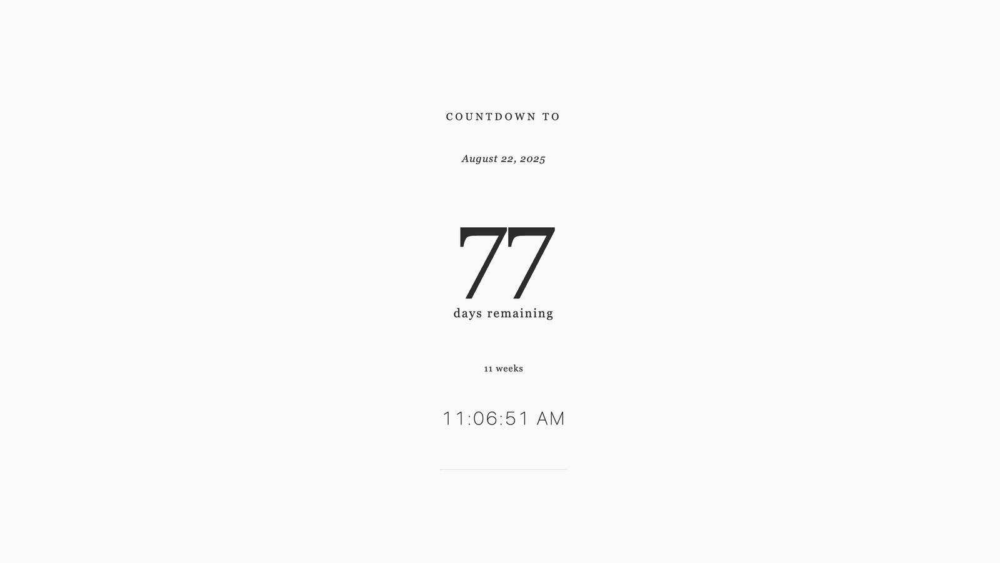

## Countdown New Tab Extension

I wanted a quick chrome extension that would show a countdown to a specific date
every time I opened a new tab. This is a simple implementation that does just
that.

[Generated via Claude.][1]

**Installation Instructions:**

1. Create a new folder called "countdown-newtab"
2. Add all the files above to this folder
3. Open Chrome and go to `chrome://extensions/`
4. Enable "Developer mode" (toggle in top right)
5. Click "Load unpacked"
6. Select your extension folder
7. Open a new tab to see your countdown!

**Features:**
- Full-screen countdown that appears on every new tab
- Zen themed
- Shows days and weeks remaining
- Live clock showing current time
- Responsive design that works on different screen sizes

The countdown will now appear every time you open a new tab in Chrome!

[1]: https://claude.ai/share/2b98724e-b4f9-42cb-b6f3-9c808d29252a
